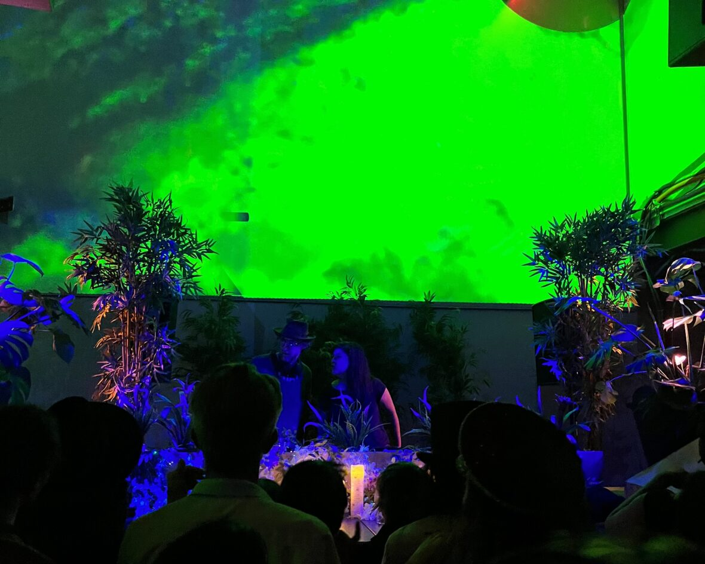
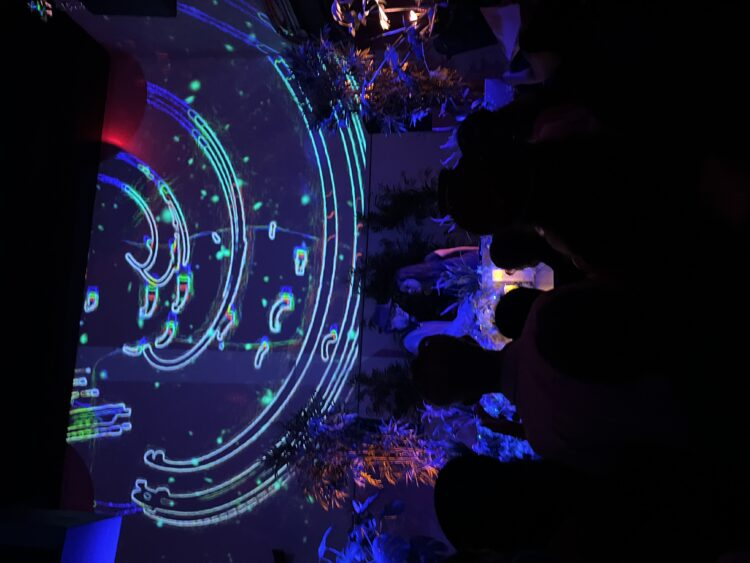

_Disclaimer: KSCU was provided with media tickets to this event in exchange for a review. This exchange had no stipulations about content of the review itself, and this is our honest and unbiased experience._

Heading up to San Fransisco, I wasn’t sure what to expect from Acid Pauli preforming for the final night of Public Works’ 12th Anniversary celebration. The last set I had been to was James Ruskin, also at Public Works, so I knew the venue, but did not know Acid Pauli himself well, with most of my exposure to him being his legendary [Tulum Boiler Room](https://youtu.be/EfZu4BCi644).

I arrived around 8pm, halfway through Arula’s set and people were flowing in. She did a great job and preformed a track with live vocals mixed in – really cool stuff. Acid Pauli began around 8:30 which, while early for a headliner, was a welcome change as this was a Sunday night.

As the prolonged intro to his first track began, the energy in the crowd shifted. While most DJs try to and build up in energy levels throughout the night, Acid Pauli took a more dynamic approach, hopping between many different sampled genres which made his stellar mixing that much more impressive.



In addition to the beautiful mixing and diverse sample choice, Acid Pauli’s visuals made for a mesmerizing experience. Rather than blast your ears with overwhelming sound, the small and intimate space that is Public Works lends itself to a unique experiences. Whenever Acid Pauli is back in the Bay, he’s a must see for techno fans.



A couple of my favorite tracks from the set.

Senses – Animal Print Remix by _Fiona Beeson_

Bortonkk by _Robag Wruhme_

Matatazela by _MOREKI_

Shumayela by _Louis Lunch_

Lastly, a big congrats to Public Works on twelve years of operation. Here are a few upcoming sets at Public Works I’d recommend if you’re into house/techno.

Sat. October 8th – Kerala Dust and Armen Miran

Sat. October 29th – Stephan Bodzin, Ame, Laolu

